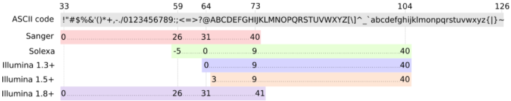
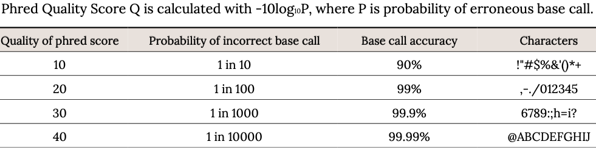
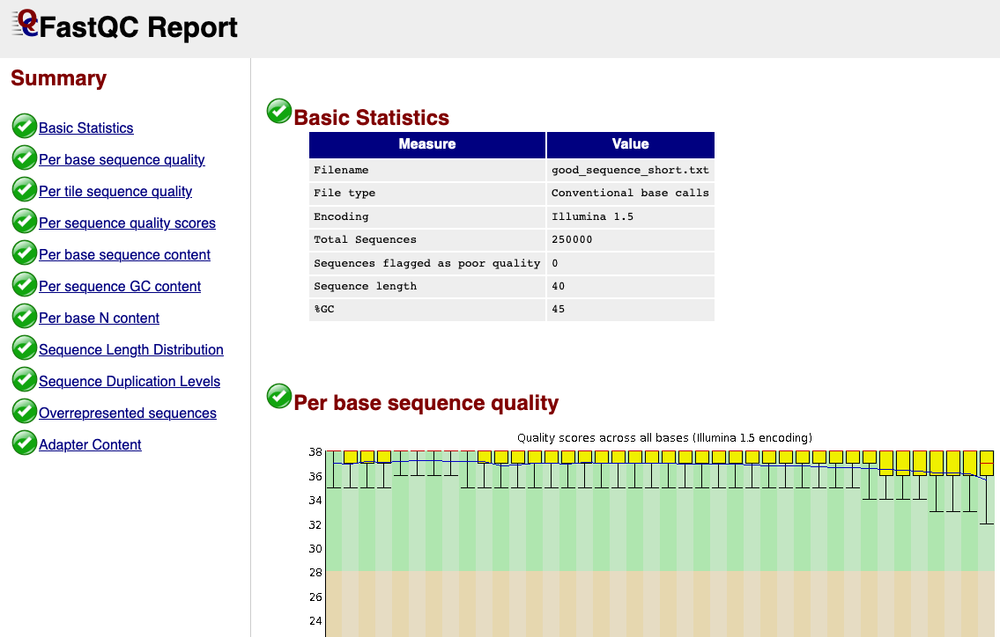
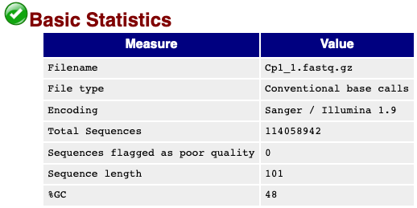
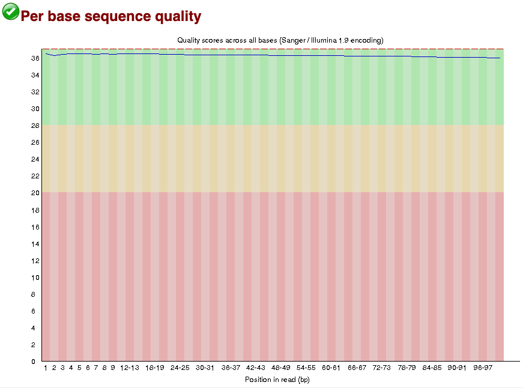
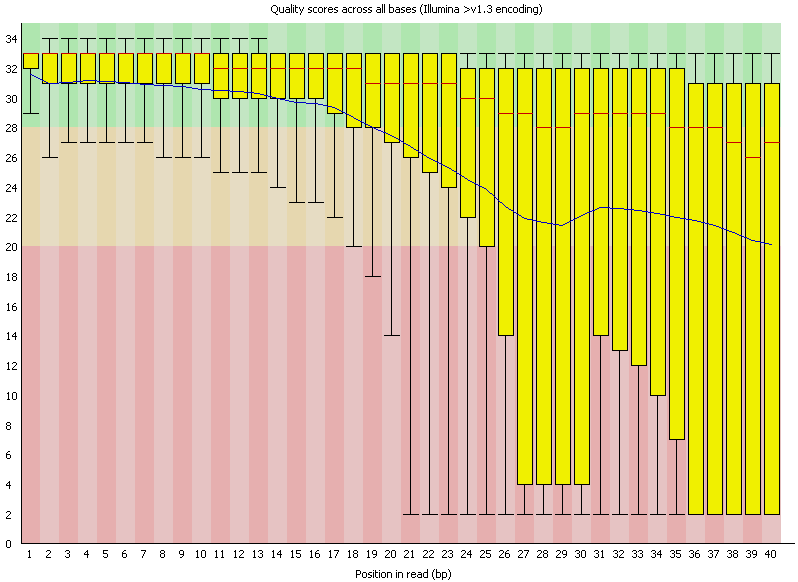
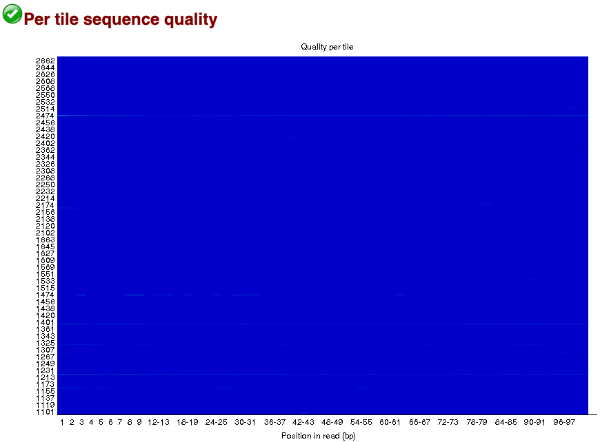
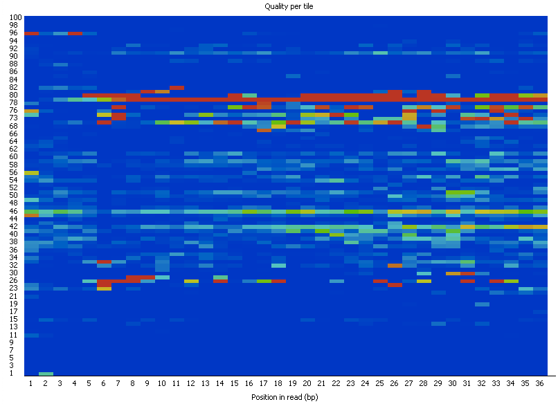
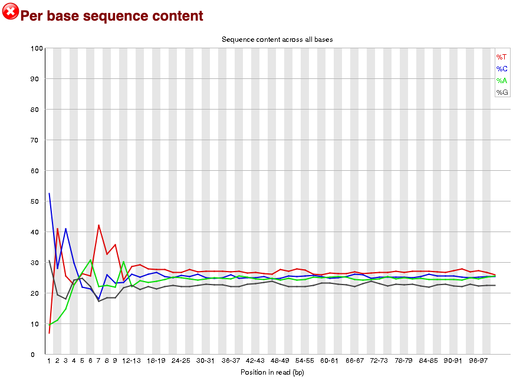

```{r setup, include=FALSE, cache=FALSE}
# set working directory to docs folder
#setwd(here::here("docs"))

# Set global R options
options(htmltools.dir.version = FALSE, servr.daemon = TRUE)

# Set global knitr chunk options
knitr::opts_chunk$set(
  fig.align = "center", 
  cache = TRUE,
  error = FALSE,
  message = FALSE, 
  warning = FALSE, 
  collapse = TRUE 
)

# xaringanExtra
library(xaringanExtra)
use_tile_view() 
use_share_again()
style_share_again(share_buttons = c("none"))

library(RefManageR)
BibOptions(check.entries = FALSE,
           bib.style = "authoryear",
           cite.style = "authoryear",
           style = "markdown",
           hyperlink = FALSE,
           dashed = FALSE)
bib <- ReadBib("biblio/bib.bib", check = FALSE)
```

class: title-slide

<br>
.font200[.f700[Bioinformatics analysis of viromes]]<br>
.font120[Turina's Lab pipeline for virome identification]

<br>
<br>
.marco[
Marco Chiapello
<br>
October 26, 2020
]

---

class: clear

.f40[**Agenda**]

.par26[

- Pipeline
  - Quality check
  - Cleaning
  - Assembly
  - Blast against viralDB
  - Manual selection I
  - Blast against NCBInr
  - Manual selection II
  - Mapping

- Orfans
]


---

layout: true
# Pipeline

---

class: inverse, middle, center

----

---

.center[
.middle[
<iframe width="840" height="473" src="https://www.youtube.com/embed/fCd6B5HRaZ8" frameborder="0" allow="accelerometer; autoplay; clipboard-write; encrypted-media; gyroscope; picture-in-picture" allowfullscreen></iframe>
]
]


---

layout: true

# Quality check

---

.f50[md5sum]

.pull-left[
.par30[

- md5sum is a computer program that calculates and verifies 128-bit MD5 hashes

- The MD5 hash functions as a compact digital fingerprint of a file
]
]

---

.f50[md5sum]

.pull-left[
.par30[

- md5sum is a computer program that calculates and verifies 128-bit MD5 hashes

- The MD5 hash functions as a compact digital fingerprint of a file
]
]

.pull-right[

<br>
.center[.f120[.f700[**DEMO**]]]
]

---

.lp[

.f40[fastq sequence]
<br>
<br>
<br>

```
@SRR031716.1 HWI-EAS299_4_30M2BAAXX:3:1:944:1798 length=37

GTGGATATGGATATCCAAATTATATTTGCATAATTTG

+SRR031716.1 HWI-EAS299_4_30M2BAAXX:3:1:944:1798 length=37

IIIIIIIIIIIIIIIIIIIIIIIIIIIII8IIIIIII
```
]

---

.lp[

.f40[fastq sequence]
<br>
<br>
<br>

```
@SRR031716.1 HWI-EAS299_4_30M2BAAXX:3:1:944:1798 length=37

GTGGATATGGATATCCAAATTATATTTGCATAATTTG

+SRR031716.1 HWI-EAS299_4_30M2BAAXX:3:1:944:1798 length=37

IIIIIIIIIIIIIIIIIIIIIIIIIIIII8IIIIIII
```
]

```{r echo=FALSE, out.width="1100px"}

```


---

.lp[

.f40[fastq sequence]
<br>
<br>
<br>

```
@SRR031716.1 HWI-EAS299_4_30M2BAAXX:3:1:944:1798 length=37

GTGGATATGGATATCCAAATTATATTTGCATAATTTG

+SRR031716.1 HWI-EAS299_4_30M2BAAXX:3:1:944:1798 length=37

IIIIIIIIIIIIIIIIIIIIIIIIIIIII8IIIIIII
```
]

```{r echo=FALSE, out.width="900px"}

```

---

class: clear, middle, center

.f70[.f900[FastQC]]

.m0tp[
.f15[https://www.bioinformatics.babraham.ac.uk/projects/fastqc/]
]

----

---

layout: true

# FastQC

---

## What is FastQC?

.m0tp.par26[

-  Modern high throughput sequencers can generate hundreds of millions of sequences in a single run. Before analysing this sequence to draw biological conclusions you should **always perform some simple quality control checks to ensure that the raw data looks good** and there are no problems or biases in your data which may affect how you can usefully use it.

- **FastQC aims to provide a QC report which can spot problems** which originate either in the sequencer or in the starting library material.

- FastQC can be run in one of two modes. It can either **run as a stand alone interactive application** for the immediate analysis of small numbers of FastQ files, or it can be run in a non-interactive mode where it would be suitable for **integrating into a larger analysis pipeline** for the systematic processing of large numbers of files. 
]

---

## Evaluating Results

.pull-left[
.m0tp[
.par20[

-  **The analysis in FastQC is performed by a series of analysis modules**. The left hand side of the main interactive display or the top of the HTML report show a summary of the modules which were run, and a quick evaluation of whether the results of the module seem entirely normal (green tick), slightly abnormal (orange triangle) or very unusual (red cross).

- It is important to stress that although the analysis results appear to give a pass/fail result, these **evaluations must be taken in the context of what you expect from your library**. Some experiments may be expected to produce libraries which are biased in particular ways. You should treat the summary evaluations therefore as pointers to where you should concentrate your attention and understand why your library may not look random and diverse.

]
]
]

.pull-rigth[
<br>
```{r echo=FALSE, out.width="550px"}

```
]

---

.pull-left[
**Basic Statistics**

.m0.par20[
The Basic Statistics module generates some simple composition statistics for the file analysed
]

.m3t[
.par20[

- **Filename**: The original filename of the file which was analysed 
-  **File type**: Says whether the file appeared to contain actual base calls or colorspace data which had to be converted to base calls
-  **Encoding**: Says which ASCII encoding of quality values was found in this file.
-  **Total Sequences**: A count of the total number of sequences processed. 
-  **Filtered Sequences**: The number of sequences with poor quality.
-  **Sequence Length**: Provides the length of the shortest and longest sequence in the set. If all sequences are the same length only one value is reported.
-  **%GC**: The overall %GC of all bases in all sequences

]
]
]

    
.pull-right[
<br>
```{r echo=FALSE, out.width="600px"}

```
]

---

.pull-left[
**Per Base Sequence Quality**

.m0.par20[
This view shows an overview of the range of quality values across all bases at each position in the FastQ file
]

.m0tp[
.par20[

- The y-axis on the graph shows the quality scores. 

- For each position a BoxWhisker type plot is drawn

- The higher the score the better the base call.
 
- The background of the graph divides the y axis into very good quality calls (green), calls of reasonable quality (orange), and calls of poor quality (red).
  
- The quality of calls on most platforms will degrade as the run progresses, so it is common to see base calls falling into the orange area towards the end of a read
]
]
]

    
.pull-right[
<br>
```{r echo=FALSE, out.width="600px"}

```
]


---

.pull-left[
**Per Base Sequence Quality**

.m0.par20[
This view shows an overview of the range of quality values across all bases at each position in the FastQ file
]

.m0tp[
.par20[

- The y-axis on the graph shows the quality scores. 

- For each position a BoxWhisker type plot is drawn

- The higher the score the better the base call.
 
- The background of the graph divides the y axis into very good quality calls (green), calls of reasonable quality (orange), and calls of poor quality (red).
  
- The quality of calls on most platforms will degrade as the run progresses, so it is common to see base calls falling into the orange area towards the end of a read
]
]
]

    
.pull-right[
<br>
```{r echo=FALSE, out.width="600px"}

```
]

---

.pull-left[
**Per Tile Sequence Quality**

.m0.par20[
 The graph allows you to look at the quality scores from each tile across all of your bases to see if there was a loss in quality associated with only one part of the flowcell
]

.m0tp[
.par20[

- The plot shows the deviation from the average quality for each tile

- The colours are on a cold to hot scale, with cold colours being positions where the quality was at or above the average and hotter colours indicate that a tile had worse qualities than other tiles for that base

- A good plot should be blue all over.
]
]
]

    
.pull-right[
<br>
```{r echo=FALSE, out.width="600px"}

```
]

---

.pull-left[
**Per Tile Sequence Quality**

.m0.par20[
 The graph allows you to look at the quality scores from each tile across all of your bases to see if there was a loss in quality associated with only one part of the flowcell
]

.m0tp[
.par20[

- The plot shows the deviation from the average quality for each tile

- The colours are on a cold to hot scale, with cold colours being positions where the quality was at or above the average and hotter colours indicate that a tile had worse qualities than other tiles for that base

- A good plot should be blue all over.
]
]
]

    
.pull-right[
<br>
```{r echo=FALSE, out.width="600px"}

```
]

---


.pull-left[
**Per Base Sequence Content**

.m0.par20[
Per Base Sequence Content plots out the proportion of each base position in a file for which each of the four normal DNA bases has been called
]

.m0tp[
.par20[

- In a random library you would expect that there would be little to no difference between the different bases of a sequence run
  
- So the lines in this plot should run parallel with each other

- Libraries produced by priming using random hexamers (including nearly all RNA-Seq libraries) inherit an intrinsic bias in the positions at which reads start. This bias does not concern an absolute sequence, but instead provides enrichement of a number of different K-mers at the 5' end of the reads
]
]
]

    
.pull-right[
<br>
```{r echo=FALSE, out.width="600px"}

```
]

---


