```{r setup, include=FALSE, cache=FALSE}
# set working directory to docs folder
#setwd(here::here("docs"))

# Set global R options
options(htmltools.dir.version = FALSE, servr.daemon = TRUE)

# Set global knitr chunk options
knitr::opts_chunk$set(
  fig.align = "center", 
  cache = TRUE,
  error = FALSE,
  message = FALSE, 
  warning = FALSE, 
  collapse = TRUE 
)

# xaringanExtra
library(xaringanExtra)
use_tile_view() 
use_share_again()
style_share_again(share_buttons = c("none"))

library(RefManageR)
BibOptions(check.entries = FALSE,
           bib.style = "authoryear",
           cite.style = "authoryear",
           style = "markdown",
           hyperlink = FALSE,
           dashed = FALSE)
bib <- ReadBib("biblio/bib.bib", check = FALSE)
```

class: title-slide

<br>
.font160[Introduzione all'analisi RNASeq in R]<br>
.font200[FastQC]
<br>
<br>
.marco[
Marco Chiapello
<br>
2023-03-31
]

---

layout: true

# FastQC

---

## What is FastQC?

.m0tp.par26[

-  Modern high throughput sequencers can generate hundreds of millions of sequences in a single run. Before analysing this sequence to draw biological conclusions you should **always perform some simple quality control checks to ensure that the raw data looks good** and there are no problems or biases in your data which may affect how you can usefully use it.

- **FastQC aims to provide a QC report which can spot problems** which originate either in the sequencer or in the starting library material.

- FastQC can be run in one of two modes. It can either **run as a stand alone interactive application** for the immediate analysis of small numbers of FastQ files, or it can be run in a non-interactive mode where it would be suitable for **integrating into a larger analysis pipeline** for the systematic processing of large numbers of files. 

```
> fastqc CP1/Cp1_1.fastq.gz CP1/Cp1_2.fastq.gz CP2/Cp2_1.fastq.gz CP2/Cp2_2.fastq.gz \
  GNO/Gno_1.fastq.gz GNO/Gno_2.fastq.gz -o quality -t 6
```
]

---

## Evaluating Results

.pull-left[
.m0tp[
.par20[

-  **The analysis in FastQC is performed by a series of analysis modules**. The left hand side of the main interactive display or the top of the HTML report show a summary of the modules which were run, and a quick evaluation of whether the results of the module seem entirely normal (green tick), slightly abnormal (orange triangle) or very unusual (red cross).

- It is important to stress that although the analysis results appear to give a pass/fail result, these **evaluations must be taken in the context of what you expect from your library**. Some experiments may be expected to produce libraries which are biased in particular ways. You should treat the summary evaluations therefore as pointers to where you should concentrate your attention and understand why your library may not look random and diverse.

]
]
]

.pull-rigth[
<br>
```{r echo=FALSE, out.width="550px"}
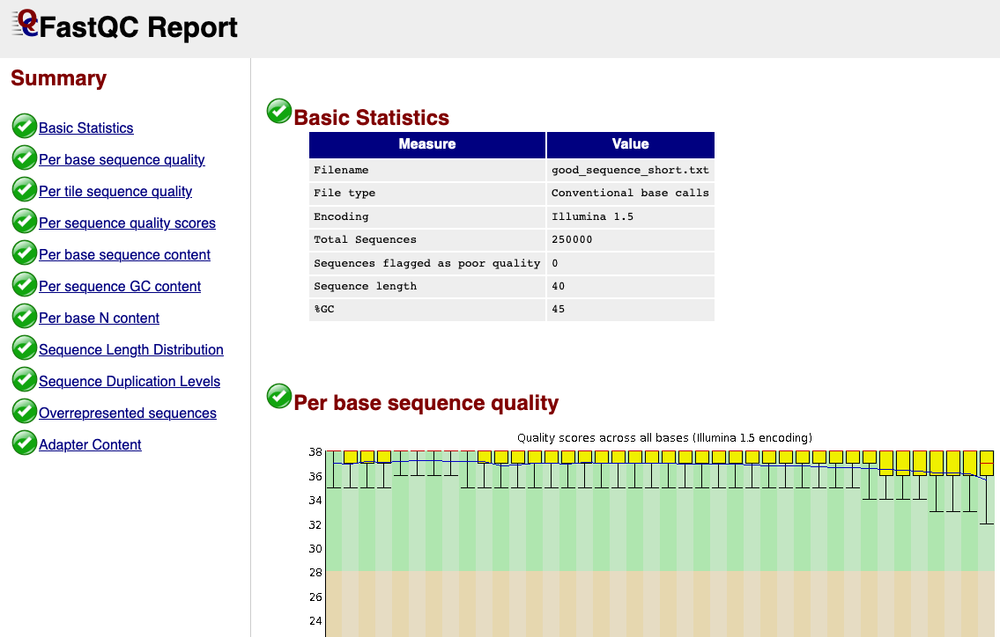
```
]

???

happy families are all alike 

every unhappy family is unhappy in its own way

---

.pull-left[
**Basic Statistics**

.m0.par20[
The Basic Statistics module generates some simple composition statistics for the file analysed
]

.m3t[
.par20[

- **Filename**: The original filename of the file which was analysed 
-  **File type**: Says whether the file appeared to contain actual base calls or colorspace data which had to be converted to base calls
-  **Encoding**: Says which ASCII encoding of quality values was found in this file.
-  **Total Sequences**: A count of the total number of sequences processed. 
-  **Filtered Sequences**: The number of sequences with poor quality.
-  **Sequence Length**: Provides the length of the shortest and longest sequence in the set. If all sequences are the same length only one value is reported.
-  **%GC**: The overall %GC of all bases in all sequences

]
]
]

    
.pull-right[
<br>
```{r echo=FALSE, out.width="600px"}
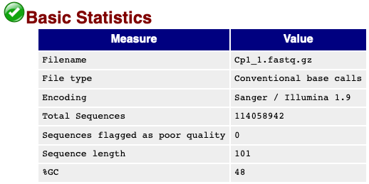
```
]

---

.pull-left[
**Per Base Sequence Quality**

.m0.par20[
This view shows an overview of the range of quality values across all bases at each position in the FastQ file
]

.m0tp[
.par20[

- The y-axis on the graph shows the quality scores. 

- For each position a BoxWhisker type plot is drawn

- The higher the score the better the base call.
 
- The background of the graph divides the y axis into very good quality calls (green), calls of reasonable quality (orange), and calls of poor quality (red).
  
- The quality of calls on most platforms will degrade as the run progresses, so it is common to see base calls falling into the orange area towards the end of a read
]
]
]

    
.pull-right[
<br>
```{r echo=FALSE, out.width="600px"}
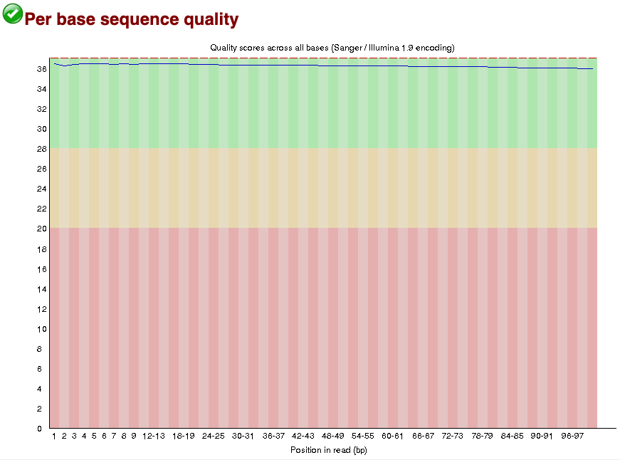
```
]


---

.pull-left[
**Per Base Sequence Quality**

.m0.par20[
This view shows an overview of the range of quality values across all bases at each position in the FastQ file
]

.m0tp[
.par20[

- The y-axis on the graph shows the quality scores. 

- For each position a BoxWhisker type plot is drawn

- The higher the score the better the base call.
 
- The background of the graph divides the y axis into very good quality calls (green), calls of reasonable quality (orange), and calls of poor quality (red).
  
- The quality of calls on most platforms will degrade as the run progresses, so it is common to see base calls falling into the orange area towards the end of a read
]
]
]

    
.pull-right[
<br>
```{r echo=FALSE, out.width="600px"}
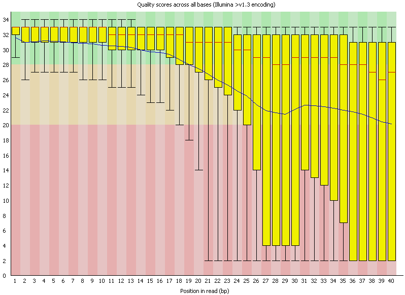
```
]

---

.pull-left[
**Per Tile Sequence Quality**

.m0.par20[
 The graph allows you to look at the quality scores from each tile across all of your bases to see if there was a loss in quality associated with only one part of the flowcell
]

.m0tp[
.par20[

- The plot shows the deviation from the average quality for each tile

- The colours are on a cold to hot scale, with cold colours being positions where the quality was at or above the average and hotter colours indicate that a tile had worse qualities than other tiles for that base

- A good plot should be blue all over.
]
]
]

    
.pull-right[
<br>
```{r echo=FALSE, out.width="600px"}
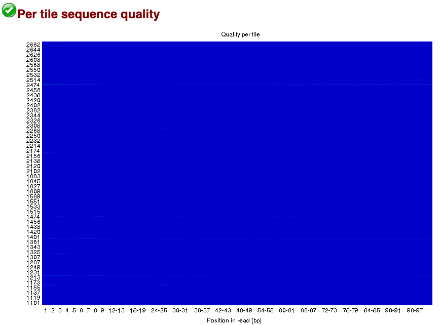
```
]

---

.pull-left[
**Per Tile Sequence Quality**

.m0.par20[
 The graph allows you to look at the quality scores from each tile across all of your bases to see if there was a loss in quality associated with only one part of the flowcell
]

.m0tp[
.par20[

- The plot shows the deviation from the average quality for each tile

- The colours are on a cold to hot scale, with cold colours being positions where the quality was at or above the average and hotter colours indicate that a tile had worse qualities than other tiles for that base

- A good plot should be blue all over.
]
]
]

    
.pull-right[
<br>
```{r echo=FALSE, out.width="600px"}
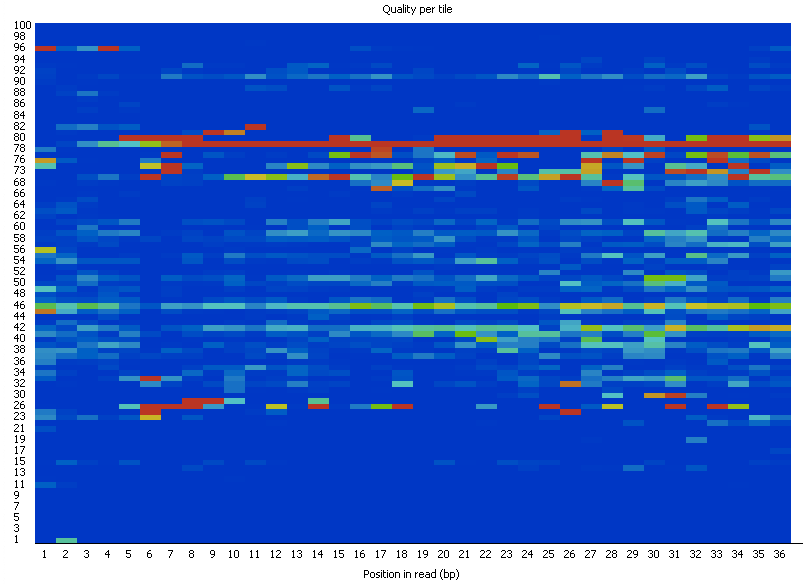
```
]

---

.pull-left[
**Per Sequence Quality Scores**

.m0.par20[
The per sequence quality score report allows you to see if a subset of your sequences have universally low quality values
]

.m0tp[
.par20[

- If a significant proportion of the sequences in a run have overall low quality then this could indicate some kind of systematic problem - possibly with just part of the run (for example one end of a flowcell)

- This module is generally fairly robust and errors here usually indicate a general loss of quality within a run

- For long runs this may be alleviated through quality trimming
]
]
]

    
.pull-right[
<br>
```{r echo=FALSE, out.width="600px"}
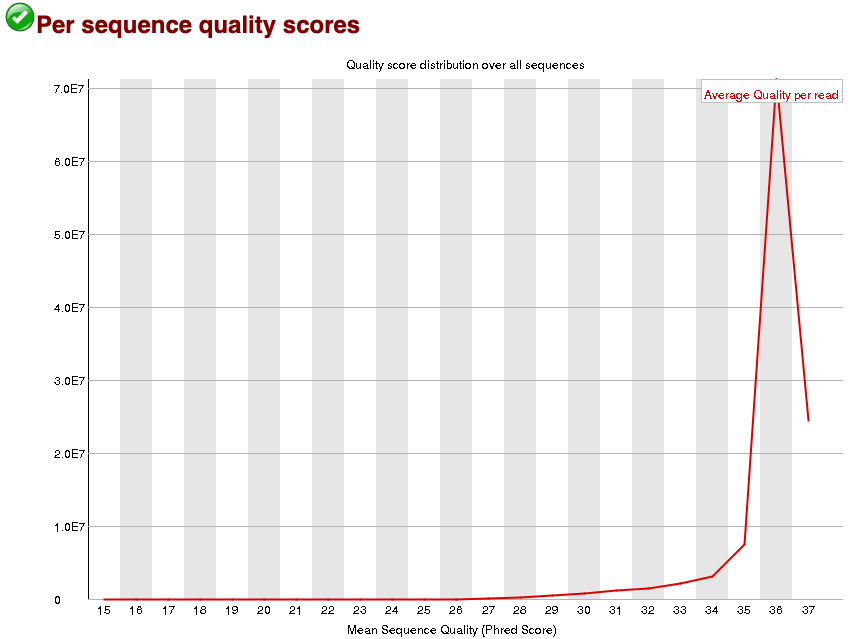
```
]

---

.pull-left[
**Per Base Sequence Content**

.m0.par20[
Per Base Sequence Content plots out the proportion of each base position in a file for which each of the four normal DNA bases has been called
]

.m0tp[
.par20[

- In a random library you would expect that there would be little to no difference between the different bases of a sequence run
  
- So the lines in this plot should run parallel with each other

- Libraries produced by priming using random hexamers (including nearly all RNA-Seq libraries) inherit an intrinsic bias in the positions at which reads start. This bias does not concern an absolute sequence, but instead provides enrichement of a number of different K-mers at the 5' end of the reads
]
]
]

    
.pull-right[
<br>
```{r echo=FALSE, out.width="600px"}
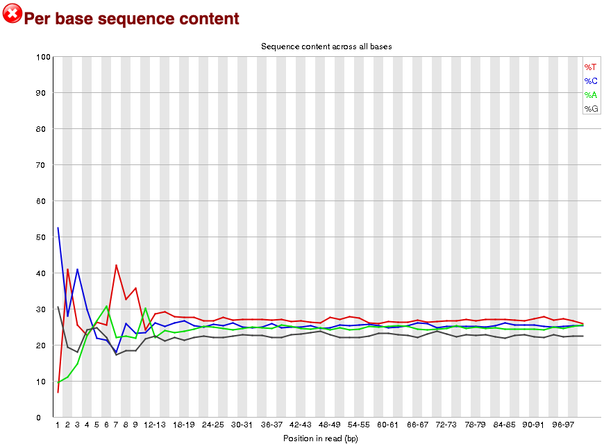
```
]

---

.pull-left[
**Per Sequence GC Content**

.m0.par20[
This module measures the GC content across the whole length of each sequence in a file and compares it to a modelled normal distribution of GC content
]

.m0tp[
.par20[

- In a normal random library you would expect to see a roughly normal distribution of GC content where the central peak corresponds to the overall GC content of the underlying genome

- An unusually shaped distribution could indicate a contaminated library or some other kinds of biased subset

- Sharp peaks on an otherwise smooth distribution are normally the result of a specific contaminant (adapter dimers for example), which may well be picked up by the overrepresented sequences module
]
]
]

    
.pull-right[
<br>
```{r echo=FALSE, out.width="600px"}
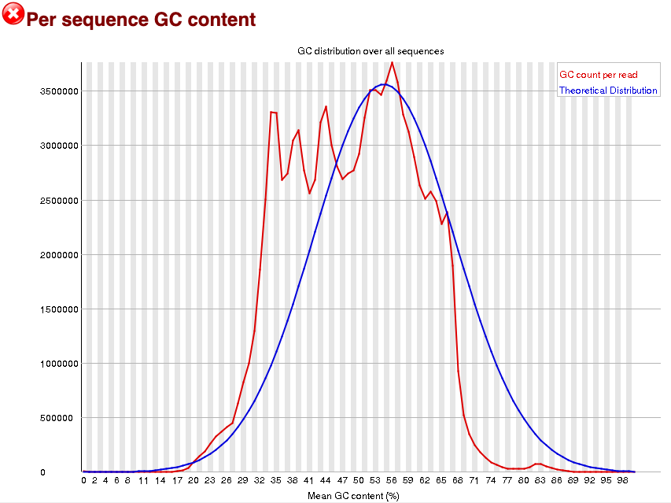
```
]

---


.pull-left[
**Per Base N Content**

.m0.par20[
If a sequencer is unable to make a base call with sufficient confidence then it will normally substitute an N rather than a conventional base call
]

.m0tp[
.par20[

- It's not unusual to see a very low proportion of Ns appearing in a sequence

- If this proportion rises above a few percent it suggests that the analysis pipeline was unable to interpret the data well enough to make valid base calls
]
]
]

    
.pull-right[
<br>
```{r echo=FALSE, out.width="600px"}
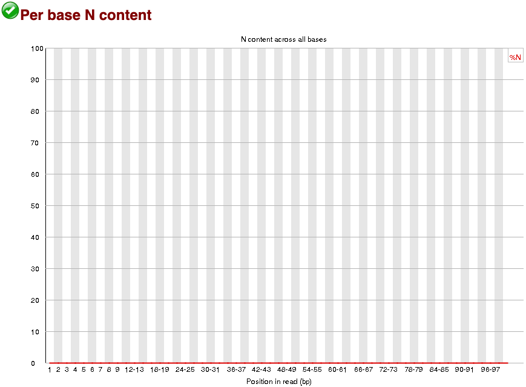
```
]

---


.pull-left[
**Sequence Length Distribution**

.m0.par20[
Some high throughput sequencers generate sequence fragments of uniform length, but others can contain reads of wildly varying lengths
]

.m0tp[
.par20[

- In many cases this will produce a simple graph showing a peak only at one size

- For variable length FastQ files this will show the relative amounts of each different size of sequence fragment
]
]
]

    
.pull-right[
<br>
```{r echo=FALSE, out.width="600px"}
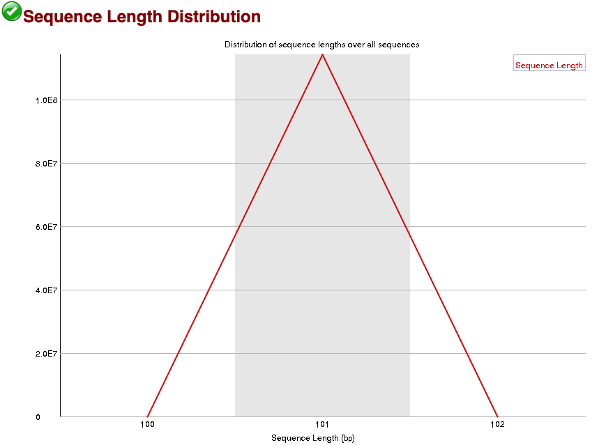
```
]

---


.pull-left[
**Duplicate Sequences**

.m0.par20[
In a diverse library most sequences will occur only once in the final set. A low level of duplication may indicate a very high level of coverage of the target sequence, but a high level of duplication is more likely to indicate some kind of enrichment bias (eg PCR over amplification)
]

.m0tp[
.par20[

- Only sequences which first appear in the first 100,000 sequences in each file are analysed

- Each sequence is tracked to the end of the file to give a representative count of the overall duplication level

-  There are two lines on the plot.
  - The blue line takes the full sequence set and shows how its duplication levels are distributed.
  - In the red plot the sequences are de-duplicated
]
]
]

    
.pull-right[
<br>
```{r echo=FALSE, out.width="600px"}
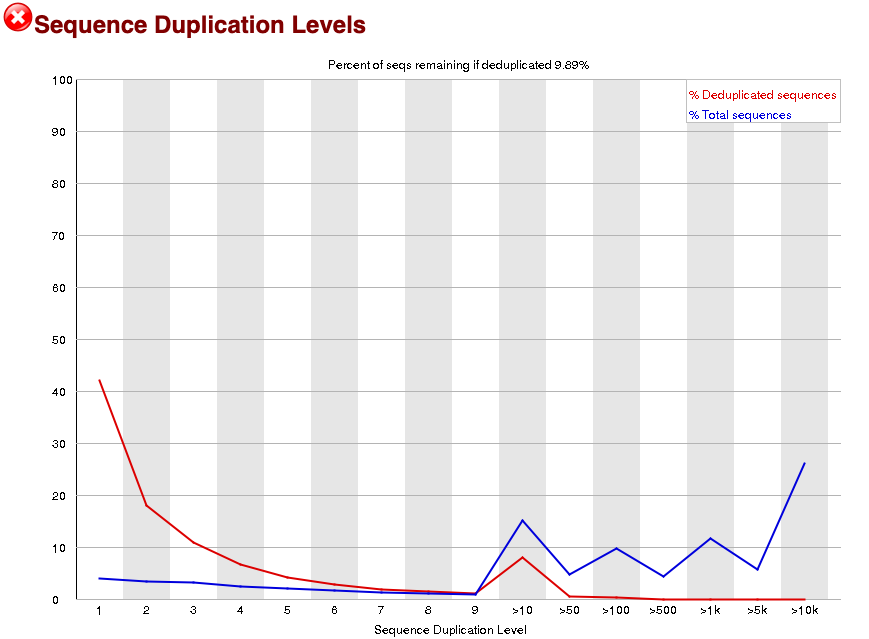
```
]

---

.pull-left[
**Duplicate Sequences**

.m0.par20[
Let's take two examples where each contain 20 reads:

- Case 1: 10 unique reads +  5 reads each present twice (duplicates)
- Case 2: 10 unique reads + 1 read present 10 times 

]

.m0tp[
.par15[

- **Case 1** shown in the upper plot will lead to 15 distinct reads and thus 15/20=75% percent remaining, the number of singletons is 1x10 =10 and the number of doubles is 5x2 =10 therefore the blue line has a plateau at those rates. The 15 distinct sequences are distributed as  10 singletons and 5 duplicates, 10/15=66% and 5/15=33% is the slope of the red line.

- **Case 2** will produce 11 distinct reads and therefore 11/20=55% will be the precent remaining reads. Again the total number of reads is equally distributed between the two cases but this time the peak will be at 10 since we have one read duplicated 10 times and that produces 10 sequences. But there are 11 total groups where 10/11=91% are singletons and 1/11=9% of the groups form at duplication rate of 10x.
]
]
]

    
.pull-right[
<br>
```{r echo=FALSE, out.width="600px"}
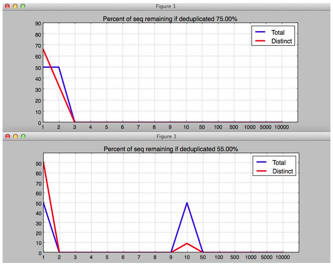
```
]

---

.pull-left[
**Overrepresented Sequences**

.m0.par20[
A normal high-throughput library will contain a diverse set of sequences, with no individual sequence making up a tiny fraction of the whole
<br><br>
- Finding that a single sequence is very overrepresented in the set either means that it is highly biologically significant, or indicates that the library is contaminated

- This module lists all of the sequence which make up more than 0.1% of the total

- Only sequences which appear in the first 100,000 sequences are tracked to the end of the file
]
]


    
.pull-right[
<br>
```{r echo=FALSE, out.width="700px"}
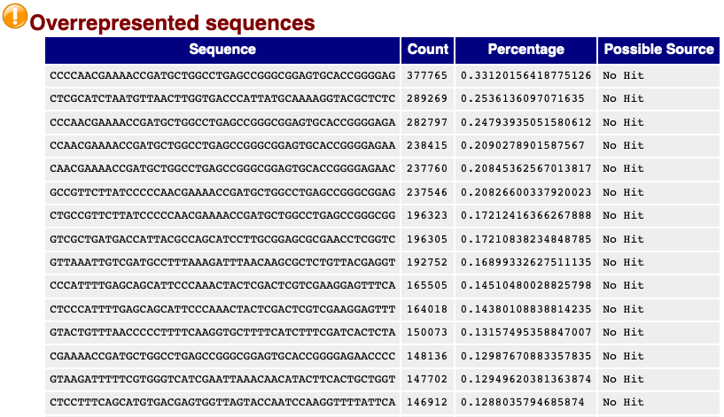
```
]

---

.pull-left[
**Adapter Content**

.m0.par20[
The Kmer Content module will do a generic analysis of all of the Kmers in your library to find those which do not have even coverage through the length of your reads. This can find a number of different sources of bias in the library which can include the presence of read-through adapter sequences building up on the end of your sequences
]
]

    
.pull-right[
<br>
```{r echo=FALSE, out.width="600px"}
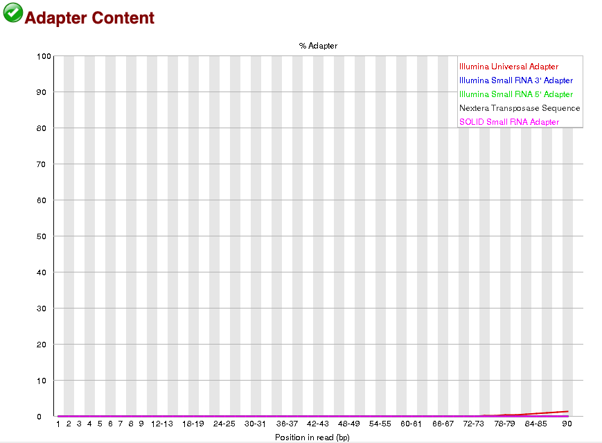
```
]

---

```{r echo=FALSE, out.width="400px"}
knitr::include_graphics("images/questions.png")
```

[back](https://mchiapello.github.io/202304_REVELO_Torvergata/materials/M5_software_code.html#/diversi-software-1)
