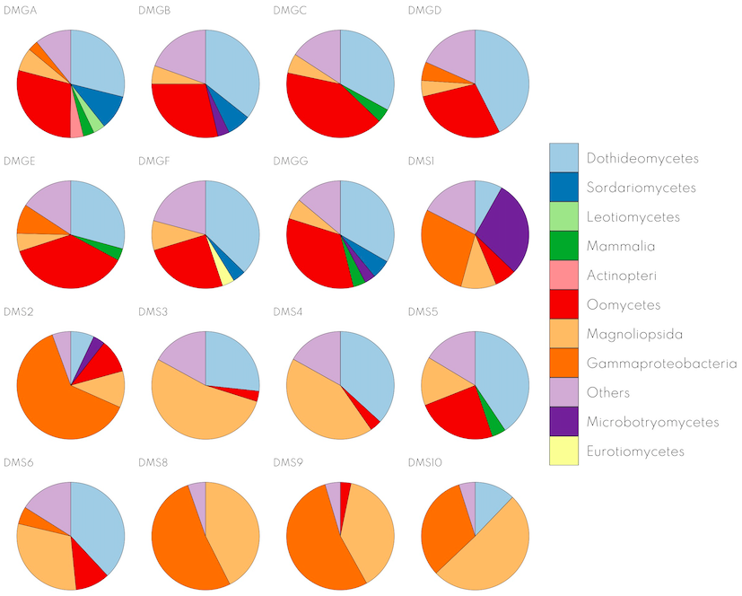
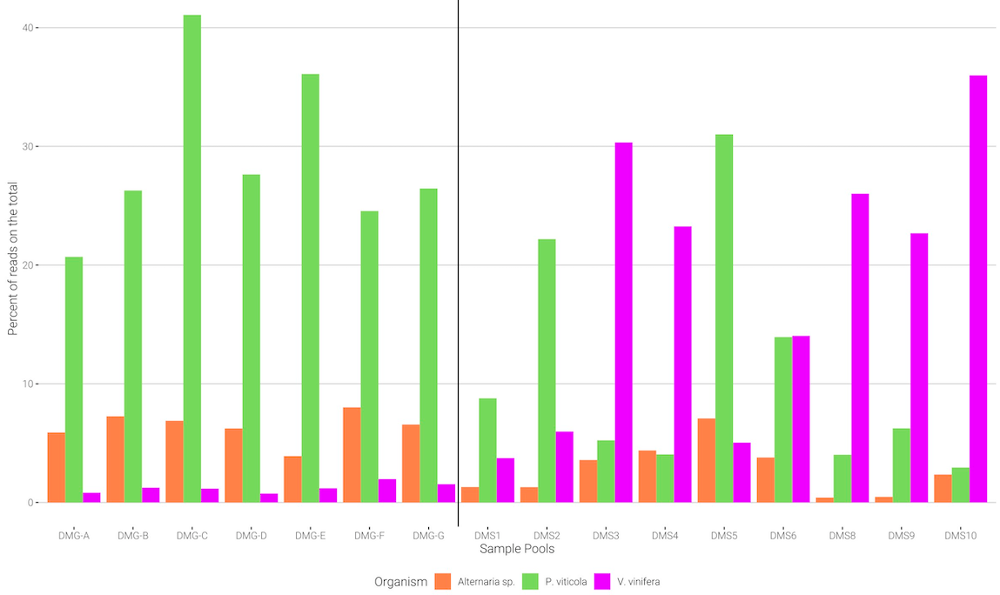
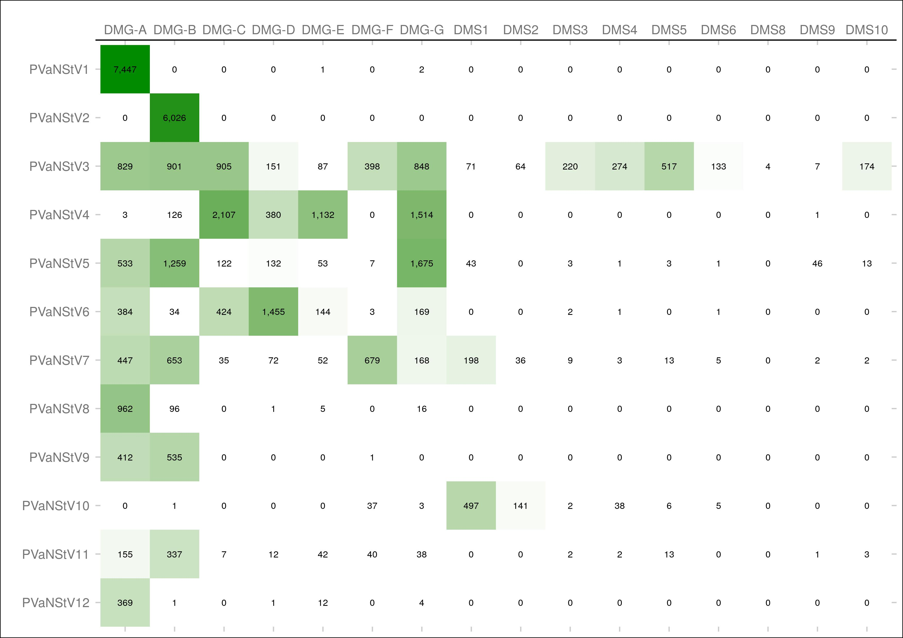
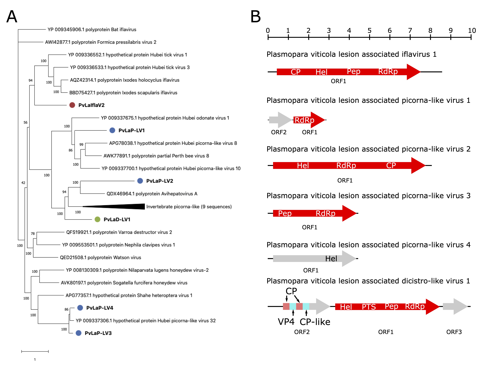
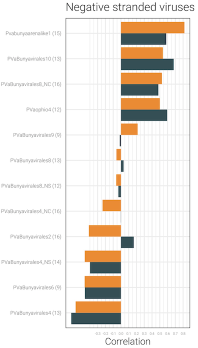
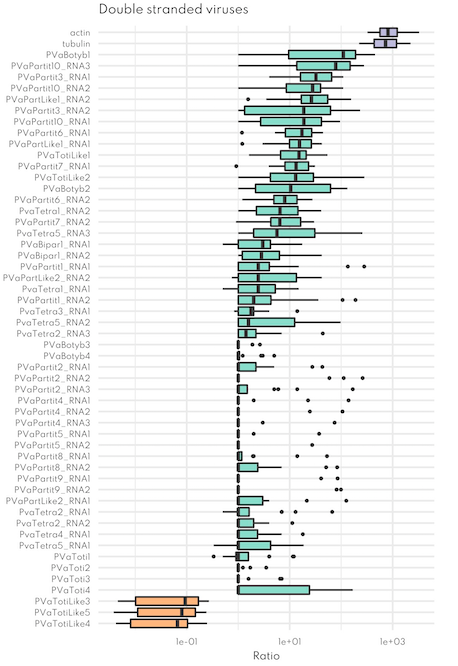

```{r setup, include=FALSE, cache=FALSE}
# set working directory to docs folder
#setwd(here::here("docs"))
# rmarkdown::render('Pres0.Rmd', 'xaringan::moon_reader')

# Set global R options
options(htmltools.dir.version = FALSE, servr.daemon = TRUE)

# Set global knitr chunk options
knitr::opts_chunk$set(
  fig.align = "center", 
  cache = TRUE,
  error = FALSE,
  message = FALSE, 
  warning = FALSE, 
  collapse = TRUE 
)

# xaringanExtra
library(xaringanExtra)
use_tile_view() 
use_share_again()
style_share_again(share_buttons = c("none"))

library(RefManageR)
BibOptions(check.entries = FALSE,
           bib.style = "authoryear",
           cite.style = "authoryear",
           style = "markdown",
           hyperlink = FALSE,
           dashed = FALSE)
bib <- ReadBib("biblio/bib.bib", check = FALSE)
```

class: title-slide

<br>
.font200[.f700[Bioinformatics analysis of viromes]]<br>
.font120[Course goal and expectations]

<br>
<br>
.marco[
Marco Chiapello
<br>
October 26, 2020
]

---

layout: true
# Expectation

---

```{r echo=FALSE, out.width="600px"}

```
.right[.font50[`r Cite(bib, key = "chiap2020")`]]

---

```{r echo=FALSE, out.width="800px"}

```
.right[.font50[`r Cite(bib, key = "chiap2020")`]]

---

```{r echo=FALSE, out.width="700px"}

```
.right[.font50[`r Cite(bib, key = "chiap2020")`]]

---

```{r echo=FALSE, out.width="650px"}

```
.right[.font50[`r Cite(bib, key = "chiap2020")`]]

---

.pull-left[

```{r echo=FALSE, out.width="300px"}

```
]

.pull-right[

```{r echo=FALSE, out.width="350px"}

```
]

.right[.font50[`r Cite(bib, key = "chiap2020")`]]

---
layout: true
# Course outcome

---

<br><br>
.content-box-red[
1. General understanding of contig viral identification `r anicon::cia("images/virus-3128.png", animate="pulse", speed="slow", anitype="hover")`

1. Overview of our pipeline `r fontawesome::fa("network-wired", fill = "black")` 

1. List of tools we use to carry out the analysis `r fontawesome::fa("chart-bar", fill = "black")` 
]

---

layout: false
class: clear, middle, center

```{r questions-tidyr, echo=FALSE, out.height="450", out.width="450"}
knitr::include_graphics("images/questions.png")
```

