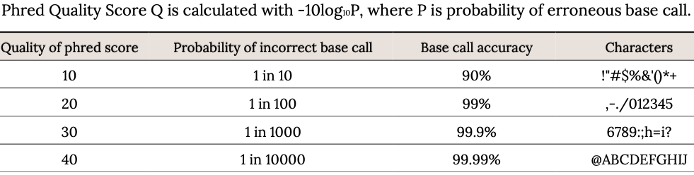
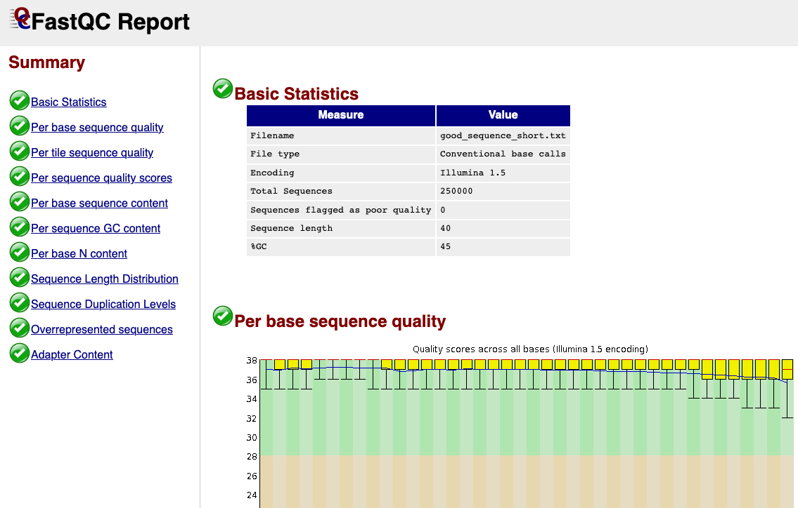
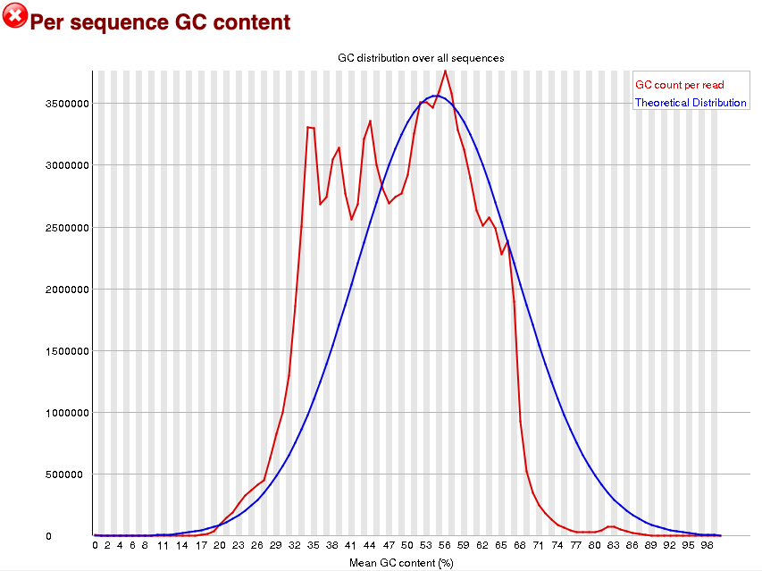
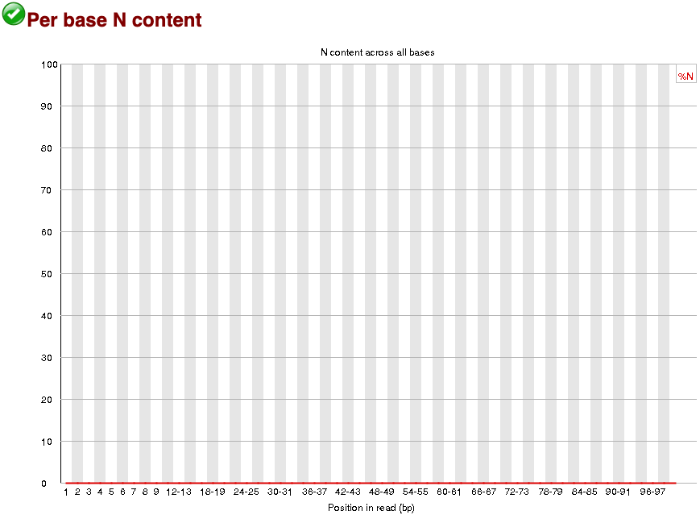
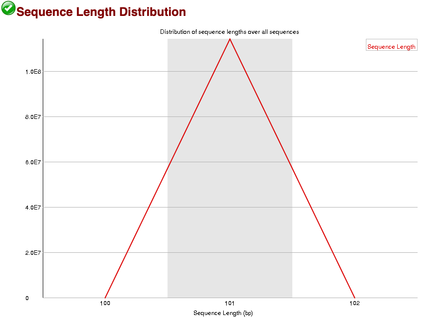
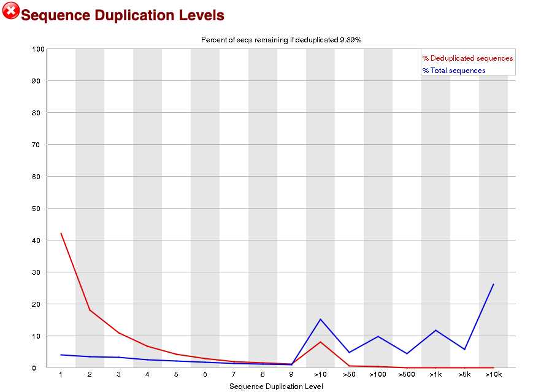

```{r setup, include=FALSE, cache=FALSE}
# set working directory to docs folder
#setwd(here::here("docs"))

# Set global R options
options(htmltools.dir.version = FALSE, servr.daemon = TRUE)

# Set global knitr chunk options
knitr::opts_chunk$set(
  fig.align = "center", 
  cache = TRUE,
  error = FALSE,
  message = FALSE, 
  warning = FALSE, 
  collapse = TRUE 
)

# xaringanExtra
library(xaringanExtra)
use_tile_view() 
use_share_again()
style_share_again(share_buttons = c("none"))

library(RefManageR)
BibOptions(check.entries = FALSE,
           bib.style = "authoryear",
           cite.style = "authoryear",
           style = "markdown",
           hyperlink = FALSE,
           dashed = FALSE)
bib <- ReadBib("biblio/bib.bib", check = FALSE)
```

class: title-slide

<br>
.font200[.f700[Bioinformatics analysis of viromes]]<br>
.font120[Turina's Lab pipeline for virome identification]

<br>
<br>
.marco[
Marco Chiapello
<br>
October 26, 2020
]

---

class: clear

.f40[**Agenda**]

.par26[

- Pipeline
  - Quality check
  - Data cleaning
  - Assembly
  - Blast against viralDB
  - Manual selection I
  - Blast against NCBInr
  - Manual selection II
  - Mapping

- Orfans

- General recommandations
  - Software version
  - Avoid manual operation
  - Master script
  - Backup
  - Version control
  - Working directory  
]


---

# Sequencing by synthesis

.center[
.middle[
<iframe width="840" height="473" src="https://www.youtube.com/embed/fCd6B5HRaZ8" frameborder="0" allow="accelerometer; autoplay; clipboard-write; encrypted-media; gyroscope; picture-in-picture" allowfullscreen></iframe>
]
]

---

# Kmers

.pull-left[
.par25[

- In bioinformatics, k-mers are subsequences of length k contained within a biological sequence

- Primarily used within the context of computational genomics and sequence analysis

- In sequence assembly, k-mers are used during the construction of De Bruijn graphs
]
]

    
.pull-right[
```{r echo=FALSE, out.width="300px"}

```
]

---

# Kmers

```{r echo=FALSE, out.width="900px"}

```

---

# De Bruijn graphs

```{r echo=FALSE, out.width="550px"}

```

---

layout: false
class: inverse, middle, center

# Pipeline

----

---

class: clear, middle, center

.f50[.red[DISCLAIM]]

.black[This is a **Command Line Interface** lesson]

.font200[`r fontawesome::fa("terminal", fill = "black")`] 

---

class: middle, center, clear

# .black[Quality check]

----

---

layout: true

# Quality check

---

.f50[On raw data]

.pull-left[
.par30[

- md5sum is a computer program that calculates and verifies 128-bit MD5 hashes

- The MD5 hash functions as a compact digital fingerprint of a file
]
]

---

.f50[md5sum]

.pull-left[
.par30[

- md5sum is a computer program that calculates and verifies 128-bit MD5 hashes

- The MD5 hash functions as a compact digital fingerprint of a file
]
]

.pull-right[

<br>
.center[.f120[.f700[**DEMO**]]]
]

---

.lp[

.f40[fastq sequence]
<br>
<br>
<br>

```
@SRR031716.1 HWI-EAS299_4_30M2BAAXX:3:1:944:1798 length=37

GTGGATATGGATATCCAAATTATATTTGCATAATTTG

+SRR031716.1 HWI-EAS299_4_30M2BAAXX:3:1:944:1798 length=37

IIIIIIIIIIIIIIIIIIIIIIIIIIIII8IIIIIII
```
]

---

.lp[

.f40[fastq sequence]
<br>
<br>
<br>

```
@SRR031716.1 HWI-EAS299_4_30M2BAAXX:3:1:944:1798 length=37

GTGGATATGGATATCCAAATTATATTTGCATAATTTG

+SRR031716.1 HWI-EAS299_4_30M2BAAXX:3:1:944:1798 length=37

IIIIIIIIIIIIIIIIIIIIIIIIIIIII8IIIIIII
```
]

```{r echo=FALSE, out.width="1100px"}
knitr::include_graphics("images/001.png")
```


---

.lp[

.f40[fastq sequence]
<br>
<br>
<br>

```
@SRR031716.1 HWI-EAS299_4_30M2BAAXX:3:1:944:1798 length=37

GTGGATATGGATATCCAAATTATATTTGCATAATTTG

+SRR031716.1 HWI-EAS299_4_30M2BAAXX:3:1:944:1798 length=37

IIIIIIIIIIIIIIIIIIIIIIIIIIIII8IIIIIII
```
]

```{r echo=FALSE, out.width="900px"}

```

---

class: clear, middle, center

.f70[.f900[FastQC]]

.m0tp[
.f15[https://www.bioinformatics.babraham.ac.uk/projects/fastqc/]
]

----

---

layout: true

# FastQC

---

## What is FastQC?

.m0tp.par26[

-  Modern high throughput sequencers can generate hundreds of millions of sequences in a single run. Before analysing this sequence to draw biological conclusions you should **always perform some simple quality control checks to ensure that the raw data looks good** and there are no problems or biases in your data which may affect how you can usefully use it.

- **FastQC aims to provide a QC report which can spot problems** which originate either in the sequencer or in the starting library material.

- FastQC can be run in one of two modes. It can either **run as a stand alone interactive application** for the immediate analysis of small numbers of FastQ files, or it can be run in a non-interactive mode where it would be suitable for **integrating into a larger analysis pipeline** for the systematic processing of large numbers of files. 

```
> fastqc CP1/Cp1_1.fastq.gz CP1/Cp1_2.fastq.gz CP2/Cp2_1.fastq.gz CP2/Cp2_2.fastq.gz \
  GNO/Gno_1.fastq.gz GNO/Gno_2.fastq.gz -o quality -t 6
```
]

---

## Evaluating Results

.pull-left[
.m0tp[
.par20[

-  **The analysis in FastQC is performed by a series of analysis modules**. The left hand side of the main interactive display or the top of the HTML report show a summary of the modules which were run, and a quick evaluation of whether the results of the module seem entirely normal (green tick), slightly abnormal (orange triangle) or very unusual (red cross).

- It is important to stress that although the analysis results appear to give a pass/fail result, these **evaluations must be taken in the context of what you expect from your library**. Some experiments may be expected to produce libraries which are biased in particular ways. You should treat the summary evaluations therefore as pointers to where you should concentrate your attention and understand why your library may not look random and diverse.

]
]
]

.pull-rigth[
<br>
```{r echo=FALSE, out.width="550px"}

```
]

???

happy families are all alike 

every unhappy family is unhappy in its own way

---

.pull-left[
**Basic Statistics**

.m0.par20[
The Basic Statistics module generates some simple composition statistics for the file analysed
]

.m3t[
.par20[

- **Filename**: The original filename of the file which was analysed 
-  **File type**: Says whether the file appeared to contain actual base calls or colorspace data which had to be converted to base calls
-  **Encoding**: Says which ASCII encoding of quality values was found in this file.
-  **Total Sequences**: A count of the total number of sequences processed. 
-  **Filtered Sequences**: The number of sequences with poor quality.
-  **Sequence Length**: Provides the length of the shortest and longest sequence in the set. If all sequences are the same length only one value is reported.
-  **%GC**: The overall %GC of all bases in all sequences

]
]
]

    
.pull-right[
<br>
```{r echo=FALSE, out.width="600px"}
knitr::include_graphics("images/Fqc2.png")
```
]

---

.pull-left[
**Per Base Sequence Quality**

.m0.par20[
This view shows an overview of the range of quality values across all bases at each position in the FastQ file
]

.m0tp[
.par20[

- The y-axis on the graph shows the quality scores. 

- For each position a BoxWhisker type plot is drawn

- The higher the score the better the base call.
 
- The background of the graph divides the y axis into very good quality calls (green), calls of reasonable quality (orange), and calls of poor quality (red).
  
- The quality of calls on most platforms will degrade as the run progresses, so it is common to see base calls falling into the orange area towards the end of a read
]
]
]

    
.pull-right[
<br>
```{r echo=FALSE, out.width="600px"}
knitr::include_graphics("images/Fqc3.png")
```
]


---

.pull-left[
**Per Base Sequence Quality**

.m0.par20[
This view shows an overview of the range of quality values across all bases at each position in the FastQ file
]

.m0tp[
.par20[

- The y-axis on the graph shows the quality scores. 

- For each position a BoxWhisker type plot is drawn

- The higher the score the better the base call.
 
- The background of the graph divides the y axis into very good quality calls (green), calls of reasonable quality (orange), and calls of poor quality (red).
  
- The quality of calls on most platforms will degrade as the run progresses, so it is common to see base calls falling into the orange area towards the end of a read
]
]
]

    
.pull-right[
<br>
```{r echo=FALSE, out.width="600px"}
knitr::include_graphics("images/Fqc4.png")
```
]

---

.pull-left[
**Per Tile Sequence Quality**

.m0.par20[
 The graph allows you to look at the quality scores from each tile across all of your bases to see if there was a loss in quality associated with only one part of the flowcell
]

.m0tp[
.par20[

- The plot shows the deviation from the average quality for each tile

- The colours are on a cold to hot scale, with cold colours being positions where the quality was at or above the average and hotter colours indicate that a tile had worse qualities than other tiles for that base

- A good plot should be blue all over.
]
]
]

    
.pull-right[
<br>
```{r echo=FALSE, out.width="600px"}
knitr::include_graphics("images/Fqc6.png")
```
]

---

.pull-left[
**Per Tile Sequence Quality**

.m0.par20[
 The graph allows you to look at the quality scores from each tile across all of your bases to see if there was a loss in quality associated with only one part of the flowcell
]

.m0tp[
.par20[

- The plot shows the deviation from the average quality for each tile

- The colours are on a cold to hot scale, with cold colours being positions where the quality was at or above the average and hotter colours indicate that a tile had worse qualities than other tiles for that base

- A good plot should be blue all over.
]
]
]

    
.pull-right[
<br>
```{r echo=FALSE, out.width="600px"}
knitr::include_graphics("images/Fqc7.png")
```
]

---

.pull-left[
**Per Sequence Quality Scores**

.m0.par20[
The per sequence quality score report allows you to see if a subset of your sequences have universally low quality values
]

.m0tp[
.par20[

- If a significant proportion of the sequences in a run have overall low quality then this could indicate some kind of systematic problem - possibly with just part of the run (for example one end of a flowcell)

- This module is generally fairly robust and errors here usually indicate a general loss of quality within a run

- For long runs this may be alleviated through quality trimming
]
]
]

    
.pull-right[
<br>
```{r echo=FALSE, out.width="600px"}
knitr::include_graphics("images/Fqc8.png")
```
]

---

.pull-left[
**Per Base Sequence Content**

.m0.par20[
Per Base Sequence Content plots out the proportion of each base position in a file for which each of the four normal DNA bases has been called
]

.m0tp[
.par20[

- In a random library you would expect that there would be little to no difference between the different bases of a sequence run
  
- So the lines in this plot should run parallel with each other

- Libraries produced by priming using random hexamers (including nearly all RNA-Seq libraries) inherit an intrinsic bias in the positions at which reads start. This bias does not concern an absolute sequence, but instead provides enrichement of a number of different K-mers at the 5' end of the reads
]
]
]

    
.pull-right[
<br>
```{r echo=FALSE, out.width="600px"}
knitr::include_graphics("images/Fqc5.png")
```
]

---

.pull-left[
**Per Sequence GC Content**

.m0.par20[
This module measures the GC content across the whole length of each sequence in a file and compares it to a modelled normal distribution of GC content
]

.m0tp[
.par20[

- In a normal random library you would expect to see a roughly normal distribution of GC content where the central peak corresponds to the overall GC content of the underlying genome

- An unusually shaped distribution could indicate a contaminated library or some other kinds of biased subset

- Sharp peaks on an otherwise smooth distribution are normally the result of a specific contaminant (adapter dimers for example), which may well be picked up by the overrepresented sequences module
]
]
]

    
.pull-right[
<br>
```{r echo=FALSE, out.width="600px"}

```
]

---


.pull-left[
**Per Base N Content**

.m0.par20[
If a sequencer is unable to make a base call with sufficient confidence then it will normally substitute an N rather than a conventional base call
]

.m0tp[
.par20[

- It's not unusual to see a very low proportion of Ns appearing in a sequence

- If this proportion rises above a few percent it suggests that the analysis pipeline was unable to interpret the data well enough to make valid base calls
]
]
]

    
.pull-right[
<br>
```{r echo=FALSE, out.width="600px"}

```
]

---


.pull-left[
**Sequence Length Distribution**

.m0.par20[
Some high throughput sequencers generate sequence fragments of uniform length, but others can contain reads of wildly varying lengths
]

.m0tp[
.par20[

- In many cases this will produce a simple graph showing a peak only at one size

- For variable length FastQ files this will show the relative amounts of each different size of sequence fragment
]
]
]

    
.pull-right[
<br>
```{r echo=FALSE, out.width="600px"}

```
]

---


.pull-left[
**Duplicate Sequences**

.m0.par20[
In a diverse library most sequences will occur only once in the final set. A low level of duplication may indicate a very high level of coverage of the target sequence, but a high level of duplication is more likely to indicate some kind of enrichment bias (eg PCR over amplification)
]

.m0tp[
.par20[

- Only sequences which first appear in the first 100,000 sequences in each file are analysed

- Each sequence is tracked to the end of the file to give a representative count of the overall duplication level

-  There are two lines on the plot.
  - The blue line takes the full sequence set and shows how its duplication levels are distributed.
  - In the red plot the sequences are de-duplicated
]
]
]

    
.pull-right[
<br>
```{r echo=FALSE, out.width="600px"}

```
]

---

.pull-left[
**Duplicate Sequences**

.m0.par20[
Let's take two examples where each contain 20 reads:

- Case 1: 10 unique reads +  5 reads each present twice (duplicates)
- Case 2: 10 unique reads + 1 read present 10 times 

]

.m0tp[
.par15[

- **Case 1** shown in the upper plot will lead to 15 distinct reads and thus 15/20=75% percent remaining, the number of singletons is 1x10 =10 and the number of doubles is 5x2 =10 therefore the blue line has a plateau at those rates. The 15 distinct sequences are distributed as  10 singletons and 5 duplicates, 10/15=66% and 5/15=33% is the slope of the red line.

- **Case 2** will produce 11 distinct reads and therefore 11/20=55% will be the precent remaining reads. Again the total number of reads is equally distributed between the two cases but this time the peak will be at 10 since we have one read duplicated 10 times and that produces 10 sequences. But there are 11 total groups where 10/11=91% are singletons and 1/11=9% of the groups form at duplication rate of 10x.
]
]
]

    
.pull-right[
<br>
```{r echo=FALSE, out.width="600px"}
knitr::include_graphics("images/Fqc14.png")
```
]

---

.pull-left[
**Overrepresented Sequences**

.m0.par20[
A normal high-throughput library will contain a diverse set of sequences, with no individual sequence making up a tiny fraction of the whole
<br><br>
- Finding that a single sequence is very overrepresented in the set either means that it is highly biologically significant, or indicates that the library is contaminated

- This module lists all of the sequence which make up more than 0.1% of the total

- Only sequences which appear in the first 100,000 sequences are tracked to the end of the file
]
]


    
.pull-right[
<br>
```{r echo=FALSE, out.width="700px"}
knitr::include_graphics("images/Fqc15.png")
```
]

---

.pull-left[
**Adapter Content**

.m0.par20[
The Kmer Content module will do a generic analysis of all of the Kmers in your library to find those which do not have even coverage through the length of your reads. This can find a number of different sources of bias in the library which can include the presence of read-through adapter sequences building up on the end of your sequences
]
]

    
.pull-right[
<br>
```{r echo=FALSE, out.width="600px"}
knitr::include_graphics("images/Fqc13.png")
```
]

---

```{r echo=FALSE, out.width="500px"}
knitr::include_graphics("images/questions.png")
```

---

class: middle, center, clear

# .black[Data cleaning] `r fontawesome::fa("broom", fill = "black")`

----

---

class: clear, middle, center

.f70[.f900[BBTools]]

.m0tp[
.f15[https://jgi.doe.gov/data-and-tools/bbtools/]
]

----

---

layout: false
# Sketch .rightH1[
`r fontawesome::fa("broom", fill = "white")`
]
 

.par23[
- This tool use a technique called MinHash to rapidly compare large sequences.  

- The result is similar to BLAST; a list of hits from a query sequence to various reference sequences, sorted by similarity, but the mechanisms are very different. 

- Sketch is designed to be extremely fast (potentially thousands of times faster than BLAST) while having a very low disk and memory footprint, but gives more approximate results and does not produce alignments.
]
<br>
```{r echo=FALSE, out.width="1100px"}

```

---

# Sketch .rightH1[
`r fontawesome::fa("broom", fill = "white")`
]

```{r echo = FALSE}
library(tidyverse)
library(DT)
library(widgetframe)
x <- read_csv("images/SketchSummary.csv") %>%
    mutate(#Pool = factor(Pool),
           rank = factor(rank, levels = c("superkingdom", "kingdom", "subkingdom",
                                          "phylum", "subphylum",
                                          "class", "subclass",
                                          "order", "family", "genus", "species")),
           name = factor(name)) 

x <- x %>%
   filter(Pool %in% c("CP1_1", "CP1_2", "CP2_1", "CP2_2", "GNO_1", "GNO_2")) %>%
   mutate(Pool = factor(Pool))

dt <- x %>%
    datatable(
      rownames = FALSE,
      filter = "top",
      extensions = 'Buttons',
      options = list(#dom = 'Bsftlip',
                     dom = 'tBp',
                     buttons = c('csv', 'copy'))
      )

frameWidget(dt)
```

---

# Clumpify .rightH1[
`r fontawesome::fa("broom", fill = "white")`
]

.pull-left[
.m0tp[
.par23[

- Clumpify is a tool designed to rapidly **group overlapping reads into clumps** 
  
- This can be used as a way to increase file compression, accelerate overlap-based assembly, or accelerate applications such as mapping 

```
> clumpify.sh in=reads.fq.gz out=clumped.fq.gz
```
]
]
]

    
.pull-right[
```{r echo=FALSE, out.width="500px"}

```
]

---

# BBDuk .rightH1[
`r fontawesome::fa("broom", fill = "white")`
]

.par23[
- "Duk" stands for Decontamination Using Kmers

- BBDuk was developed to combine most common data-quality-related trimming, filtering, and masking operations into a single high-performance tool

- It is capable of quality-trimming and filtering, adapter-trimming, contaminant-filtering via kmer matching, sequence masking, GC-filtering, length filtering, entropy-filtering, format conversion, histogram generation, subsampling, quality-score recalibration, kmer cardinality estimation, and various other operations in a single pass

- Any combination of operations is possible in a single pass, with the exception of kmer-based operations (kmer trimming, kmer masking, or kmer filtering); at most 1 kmer-based operation can be done in a single pass
]

---

# BBDuk - Adapter trimming .rightH1[
`r fontawesome::fa("broom", fill = "white")`
]

```
> bbduk.sh in=reads.fq out=clean.fq ref=adapters.fa ktrim=r k=23 mink=11 hdist=1 tpe tbo
```

.par23[

- "ktrim=r" is for right-trimming (3′ adapters)    

- "k" specifies the kmer size to use (must be at most the length of the adapters)    

- "mink"" allows it to use shorter kmers at the ends of the read    

- "hdist" means “hamming distance”; this allows one mismatch    

- "tbo" which specifies to also trim adapters based on pair overlap detection    

- "tpe" which specifies to trim both reads to the same length    
]

---

# BBDuk - Kmer filtering .rightH1[
`r fontawesome::fa("broom", fill = "white")`
]

## Artefacts removal

```
> bbduk.sh in=reads.fq out=unmatched.fq outm=matched.fq ref=phix.fa.gz k=31 hdist=1 stats=stats.txt
``` 
<br>
.par23[
This will remove all reads that have a 31-mer match to phix sequences (common illumina spiked in sequences), allowing one mismatch

"stats" will produce a report of which contaminant sequences were seen

The “outm” stream will catch reads that matched a reference kmers

.content-box-red[
This allows you to split a set of reads based on the presence of something
]
]

---

# BBDuk - Kmer filtering .rightH1[
`r fontawesome::fa("broom", fill = "white")`
]

## Short removal

```
> bbduk.sh in=reads.fq out=unmatched.fq outm=matched.fq ref=short.fa.gz k=31 hdist=1 stats=stats.txt
``` 
<br>
.par23[
This will remove all reads that have a 31-mer match to short sequences, allowing one mismatch

"stats" will produce a report of which contaminant sequences were seen

The “outm” stream will catch reads that matched a reference kmers

]

---

# BBDuk - Kmer filtering .rightH1[
`r fontawesome::fa("broom", fill = "white")`
]

## Ribosomal removal

```
> bbduk.sh in=reads.fq out=unmatched.fq outm=matched.fq ref=ribosomal.fa.gz k=31 hdist=1 stats=stats.txt
``` 
<br>
.par23[
This will remove all reads that have a 31-mer match to ribosomal sequences, allowing one mismatch

"stats" will produce a report of which contaminant sequences were seen

The “outm” stream will catch reads that matched a reference kmers

]

---

# BBDuk - Kmer filtering .rightH1[
`r fontawesome::fa("broom", fill = "white")`
]

## Genome removal

```
> bbduk.sh in=reads.fq out=unmatched.fq outm=matched.fq ref=genome.fa.gz k=31 hdist=1 stats=stats.txt
``` 
<br>
.par23[
This will remove all reads that have a 31-mer match to genome sequences, allowing one mismatch

"stats" will produce a report of which contaminant sequences were seen

The “outm” stream will catch reads that matched a reference kmers

]

---

# BBNorm - Normalize .rightH1[
`r fontawesome::fa("broom", fill = "white")`
]

## Normalize coverage

```
> bbnorm.sh in=reads.fq out=normalized.fq
``` 
<br>
.par23[
BBNorm is designed to normalize coverage by down-sampling reads, resulting in a flat coverage distribution

This process can dramatically accelerate assembly and often improve assembly quality

The resulting file can no be used for mapping purpose

]

---

# Data cleaning .rightH1[
`r fontawesome::fa("broom", fill = "white")`
]

## Resulting files

```
CP1_1.fastq.gz 5.6G
CP1_2.fastq.gz 5.9G
```
<br>
```
CP1_1_clean.fastq.gz 352M
CP1_2_clean.fastq.gz 449M
```
<br>
```
CP1_1_map.fastq.gz 1.8G
CP1_2_map.fastq.gz 2.3G
```

---

# Data cleaning .rightH1[
`r fontawesome::fa("broom", fill = "white")`
]

```{r echo=FALSE, out.width="500px"}
knitr::include_graphics("images/questions.png")
```

---

class: middle, center, clear

# .black[RNA-Seq De novo Assembly] 

----

---

class: clear, middle, center

.f70[.f900[Trinity]]

.m0tp[
.f15[https://github.com/trinityrnaseq/trinityrnaseq/wiki]
]

----

---

layout: true

# Trinity .rightH1[
`r fontawesome::fa("blackberry", fill = "white")`
]

---

.pull-left[
.m0tp[
.par15[

- Trinity, developed at the Broad Institute and the Hebrew University of Jerusalem, represents a novel method for the efficient and robust de novo reconstruction of transcriptomes from RNA-seq data

- Trinity combines three independent software modules:
  - **Inchworm** assembles the RNA-seq data into the unique sequences of transcripts, often generating full-length transcripts for a dominant isoform, but then reports just the unique portions of alternatively spliced transcripts

  - **Chrysalis** clusters the Inchworm contigs into clusters and constructs complete de Bruijn graphs for each cluster. Each cluster represents the full transcriptonal complexity for a given gene (or sets of genes that share sequences in common). Chrysalis then partitions the full read set among these disjoint graphs.

  - **Butterfly** then processes the individual graphs in parallel, tracing the paths that reads and pairs of reads take within the graph, ultimately reporting full-length transcripts for alternatively spliced isoforms, and teasing apart transcripts that corresponds to paralogous genes.
]
]
]

    
.pull-right[
```{r echo=FALSE, out.width="500px"}

```
]

---

.pull-left[
.m0tp[
.par15[

- Trinity, developed at the Broad Institute and the Hebrew University of Jerusalem, represents a novel method for the efficient and robust de novo reconstruction of transcriptomes from RNA-seq data

- Trinity combines three independent software modules:
  - **Inchworm** assembles the RNA-seq data into the unique sequences of transcripts, often generating full-length transcripts for a dominant isoform, but then reports just the unique portions of alternatively spliced transcripts

  - **Chrysalis** clusters the Inchworm contigs into clusters and constructs complete de Bruijn graphs for each cluster. Each cluster represents the full transcriptonal complexity for a given gene (or sets of genes that share sequences in common). Chrysalis then partitions the full read set among these disjoint graphs.

  - **Butterfly** then processes the individual graphs in parallel, tracing the paths that reads and pairs of reads take within the graph, ultimately reporting full-length transcripts for alternatively spliced isoforms, and teasing apart transcripts that corresponds to paralogous genes.
]
]
]

    
.pull-right[
```{r echo=FALSE, out.width="450px"}
knitr::include_graphics("images/t2.png")
```
]

---

## Trinity commands

- .font80[De-novo assembly]

```
> Trinity --seqType fq --max_memory 50G --left reads_1.fq  --right reads_2.fq --CPU 6
```

- .font80[Genome guides assembly]

```
> Trinity --genome_guided_bam rnaseq_alignments.csorted.bam --max_memory 50G --genome_guided_max_intron 10000 --CPU 6
```

---

## Output of Trinity Assembly

.par23[
- When Trinity completes, it will create a 'Trinity.fasta' output file in the 'trinity\_out\_dir/' output directory

- Trinity groups transcripts into clusters based on shared sequence content

- Such a transcript cluster is very loosely referred to as a 'gene'

- This information is encoded in the Trinity fasta accession

]

--

```
>TRINITY_DN1000_c115_g5_i1 len=247 path=[31015:0-148 23018:149-246]
AATCTTTTTTGGTATTGGCAGTACTGTGCTCTGGGTAGTGATTAGGGCAAAAGAAGACAC
ACAATAAAGAACCAGGTGTTAGACGTCAGCAAGTCAAGGCCTTGGTTCTCAGCAGACAGA
AGACAGCCCTTCTCAATCCTCATCCCTTCCCTGAACAGACATGTCTTCTGCAAGCTTCTC
CAAGTCAGTTGTTCACAGGAACATCATCAGAATAAATTTGAAATTATGATTAGTATCTGA
TAAAGCA
```

---

## Output of Trinity Assembly

```
>TRINITY_DN1000_c115_g5_i1 len=247 path=[31015:0-148 23018:149-246]
AATCTTTTTTGGTATTGGCAGTACTGTGCTCTGGGTAGTGATTAGGGCAAAAGAAGACAC
ACAATAAAGAACCAGGTGTTAGACGTCAGCAAGTCAAGGCCTTGGTTCTCAGCAGACAGA
AGACAGCCCTTCTCAATCCTCATCCCTTCCCTGAACAGACATGTCTTCTGCAAGCTTCTC
CAAGTCAGTTGTTCACAGGAACATCATCAGAATAAATTTGAAATTATGATTAGTATCTGA
TAAAGCA
```

--

.par20[

**TRINITY_DN1000_c115**_g5_i1: indicates Trinity read cluster

TRINITY_DN1000_c115_**g5**_i1: indicates Trinity gene

TRINITY_DN1000_c115_g5_**i1**: indicates Trinity isoform

**path=[31015:0-148 23018:149-246]**: indicates the path traversed in the Trinity compacted de Bruijn graph to construct that transcript 

]

--

.right[Once your assembly is complete, you'll want to know how 'good' it is]

---

## Examine the RNA-Seq read representation of the assembly

To assess the read composition of our assembly, we want to capture and count all reads that map to our assembled transcripts

.font60[First, build a bowtie2 index for the transcriptome]

```
> bowtie2-build Trinity.fasta Trinity.fasta
```

.font60[Then perform the alignment to just capture the read alignment statistics]

```
> bowtie2 -p 10 -q --no-unal -k 20 -x Trinity.fasta -1 reads_1.fq -2 reads_2.fq  \
     2>align_stats.txt| samtools view -@10 -Sb -o bowtie2.bam 
```

---

## Examine the RNA-Seq read representation of the assembly

To assess the read composition of our assembly, we want to capture and count all reads that map to our assembled transcripts

.font60[Visualize statistics]

.pull-left[
.m0tp[
.code50[
```
> cat 2>&1 align_stats.txt

76201190 reads; of these:
  76201190 (100.00%) were paired; of these:
    18166307 (23.84%) aligned concordantly 0 times
    17026716 (22.34%) aligned concordantly exactly 1 time
    41008167 (53.82%) aligned concordantly >1 times
    ----
    18166307 pairs aligned concordantly 0 times; of these:
      1769907 (9.74%) aligned discordantly 1 time
    ----
    16396400 pairs aligned 0 times concordantly or discordantly; of these:
      32792800 mates make up the pairs; of these:
        15287552 (46.62%) aligned 0 times
        3874965 (11.82%) aligned exactly 1 time
        13630283 (41.56%) aligned >1 times
*89.97% overall alignment rate
```
]
]
]

    
.pull-right[
Ideally, at least ~80% of your input RNA-Seq reads are represented by your transcriptome assembly
]

---

## Post Transcriptome Assembly Downstream Analyses

.par23[

Once your assembly is complete, there are several analyses you will likely want to pursue to explore aspects of the biology of your organism based on your assembled transcripts and the input RNA-Seq data

- **Quantifying transcript and gene abundance**. This is a prerequisite to many other analyses such as examining differentially expressed transcripts among your samples.

- **Quality checking your samples and biological replicates**. Make sure the relationships among your samples and biological replicates make sense. If there are any confounding aspects to the data, such as outliers or batch effects, you'll want to catch them as early as possible and account for them in your further data explorations.

- **Perform differential expression analysis**. Trinity provides direct support for several DE analysis methods, including edgeR, DESeq2, Limma/Voom, and ROTS.

- **Extract coding regions** using TransDecoder and functionally annotate the transcripts using Trinotate.

]

---

```{r echo=FALSE, out.width="500px"}
knitr::include_graphics("images/questions.png")
```

---

class: middle, center, clear

# .black[Viral contig identification] 

----

---

class: clear, middle, center

.f70[.f900[NCBI BLAST+]]

.m0tp[
.f15[https://www.ncbi.nlm.nih.gov/books/NBK131777]
]

----

---

layout: true

# BLAST+ .rightH1[
`r fontawesome::fa("database", fill = "white")`
]

---

## ViralDB creation - Proteins

| Name | group | taxid |
|---|---|---|
|Virtovirus|genus|txid1925802|
|Papanivirus|genus|txid1921431|
|Aumaivirus|genus|txid1917979|
|Albetovirus|genus|txid1915204|
|Sarthroviridae|family|txid1922240|
|Polymycoviridae|family|txid2732900|
|Cressdnaviricota|phylum|txid2732416|
|Orthornavirae|kingdom|txid2732396|

.center.font70[https://www.ncbi.nlm.nih.gov/labs/virus/vssi/#/]

---

## Diamond blast

.content-box-red[
**DIAMOND** is a sequence aligner for protein and translated DNA searches, designed for high performance analysis of big sequence data
]

.par23[
The key features are:

- Pairwise alignment of proteins and translated DNA at 100x-20,000x speed of BLAST.

- Low resource requirements and suitable for running on standard desktops or laptops.
    
- Various output formats, including BLAST pairwise, tabular and XML, as well as taxonomic classification.
]

---

## Diamond blast

.font70[Prepare viral database]

```
> diamond makedb --in viralDB.faa -d ViralDB
```

.font70[Make blast]

```
# Alignment
> diamond blastx -p30 -d viralDB -q trinity_out_dir.Trinity.fasta \
  -o CP1_DiamondBlast.blast -f 0 -k 2 --unal 0 --very-sensitive
```

```
# Tabular
> diamond blastx -p30 -d viralDB -q trinity_out_dir.Trinity.fasta \
  -o CP1_DiamondBlast.tab -f 6 qseqid qlen sseqid slen pident length \
  mismatch gapopen qstart qend sstart send evalue bitscore -k 2 --unal 0 --very-sensitive
```

---

## Alignment output

.code40[
```
Query= TRINITY_DN1830_c0_g1_i42 len=4362 path=[0:0-172 2:173-354 3:355-355 4:356-646 6:647-936 8:937-1831 10:1832-1840 12:1841-1921 13:1922-2257 15:2258-2366 16:2367-2600 17:2601-2964 18:2965-3936 19:3937-4361]

Length=4362

>APY28336.1 |dUTPAse-like protein [pasivirus A3]
Length=140

 Score = 72.8 bits (177),  Expect = 2.4e-10
  Identities = 40/118 (33%), Positives = 59/118 (50%), Gaps = 0/118 (0%)
   Frame = -2

Query  4154  DTMAAPPLMIKRLSEKARLPTRGSAFAAGYDIYASKPTVIPARGKALVDTDISMACPPGT 3975
             D    P L  +RLS  A LP++    +  YD+Y +  T IP   + ++ TDI +  P   
             Sbjct     7  DERPVPRLGFERLSPAALLPSQNPKRSMTYDLYCAYSTTIPPHDRRVLLTDIRVYVPESC 66

Query  3974  YGRIAPRSGLASKHFIDTGAGVIDADYRGQVKILLFNHSEADFSVSEGDRVAQLVLER 3801
             YG I PR     K F+D G G ++ + R  + I  FN S++ FS   GD +  + L R
             Sbjct    67  YGVIEPRCVFDPKFFLDAGKGCVEHNCRDNISITFFNLSDSPFSFRRGDMLCSVTLFR 124
```
]

## Tabular output

.code40[
```
*TRINITY_DN1830_c0_g1_i42        4362    APY28336.1      140     33.9    118     78      0       4154    3801    7       124      2.4e-10 72.8
TRINITY_DN1830_c0_g1_i7 4253    APY28336.1      140     33.9    118     78      0       4045    3692    7       124     2.3e-10  72.8
TRINITY_DN1853_c0_g2_i6 5154    QJC19294.1      4920    22.2    451     272     16      4236    2908    3107    3486    1.3e-07  63.9
TRINITY_DN1853_c0_g2_i6 5154    ATB20098.1      4920    22.0    451     273     16      4236    2908    3107    3486    1.3e-07  63.9
TRINITY_DN1853_c0_g2_i2 5332    QJC19294.1      4920    22.2    451     272     16      4320    2992    3107    3486    1.3e-07  63.9
TRINITY_DN1853_c0_g2_i2 5332    ATB20098.1      4920    22.0    451     273     16      4320    2992    3107    3486    1.3e-07  63.9
TRINITY_DN1853_c0_g2_i3 5334    QJC19294.1      4920    22.2    451     272     16      4416    3088    3107    3486    1.3e-07  63.9
TRINITY_DN1853_c0_g2_i3 5334    ATB20098.1      4920    22.0    451     273     16      4416    3088    3107    3486    1.3e-07  63.9
TRINITY_DN1853_c0_g2_i7 5238    QJC19294.1      4920    22.2    451     272     16      4320    2992    3107    3486    1.3e-07  63.9
TRINITY_DN1853_c0_g2_i7 5238    ATB20098.1      4920    22.0    451     273     16      4320    2992    3107    3486    1.3e-07  63.9
```
]

---

## Tabular makeup

<br>
.table10[
|Pool|qseqid|qlen|sseqid|slen|pident|length|evalue|Org|Description|ID|
|---|---|---|---|---|---|---|---|---|---|---|
|CP1|TRINITY_DN1010_c1_g1_i12|2473|QDH89109.1|224|76.1|209|2.4e-92|Picornavirales sp.|"hypothetical protein H1BulkLitter557_000002 partial"|CP1_TRINITY_DN1010_c1_g1_i12|
|CP1|TRINITY_DN1048_c0_g1_i37|6656|YP_874188.1|599|23.6|440|2e-13|Raspberry leaf mottle virus|HSP 70h|CP1_TRINITY_DN1048_c0_g1_i37|
|CP1|TRINITY_DN105_c0_g1_i39|1922|QJE50384.1|452|100|35|3.6e-11|Mammalian orthoreovirus 5|Sigma 2|CP1_TRINITY_DN105_c0_g1_i39|
|CP1|TRINITY_DN1079_c1_g2_i2|4896|QDH91349.1|325|45.9|279|3.4e-58|Partitiviridae sp.|"hypothetical protein H3Bulk427771_000001 partial"|CP1_TRINITY_DN1079_c1_g2_i2|
|CP1|TRINITY_DN116_c2_g1_i1|7773|QLL27747.1|1466|22.8|180|1.3e-6|Leveillula taurica associated alphamesonivirus 1|"putative helicase partial"|CP1_TRINITY_DN116_c2_g1_i1|
|CP1|TRINITY_DN1179_c0_g1_i4|4529|QDH91227.1|467|24.5|220|2.1e-6|Riboviria sp.|hypothetical protein H4RhizoLitter191464_000002|CP1_TRINITY_DN1179_c0_g1_i4|
|CP1|TRINITY_DN1183_c0_g1_i8|6656|QDH91349.1|325|40.9|237|1.1e-40|Partitiviridae sp.|"hypothetical protein H3Bulk427771_000001 partial"|CP1_TRINITY_DN1183_c0_g1_i8|
|CP1|TRINITY_DN1183_c1_g2_i2|2575|AHC94771.1|550|30|423|4.5e-33|Human orthopneumovirus|firefly luciferase|CP1_TRINITY_DN1183_c1_g2_i2|
]

---
## Manual inspection of the alignment results


## Naive tabular approach

----

<br>

.content-box-blue[
In both cases the output is a fasta file containing the selected contigs <br>**possible viral contigs**
]

---

## Diamond blast

.font70[Prepare NCBInr database]

```
> diamond makedb --in NCBInr.faa -d NCBInr
```

.font70[Make blast]

```
# Alignment
> diamond blastx -p30 -d NCBInr -q CP1_viralDB_selection.fasta \
  -o CP1_viralDB_selection.blast -f 0 -k 2 --unal 0 --very-sensitive
```

```
# Tabular
> diamond blastx -p30 -d viralDB -q CP1_viralDB_selection.fasta \
  -o CP1_viralDB_selection.tab -f 6 qseqid qlen sseqid slen pident length \
  mismatch gapopen qstart qend sstart send evalue bitscore -k 2 --unal 0 --very-sensitive
```

---

.content-box-red[
Blast against NCBInr allows to identify the contigs that are not viral
<br>
They can be fragments integrated in the host genome
]
